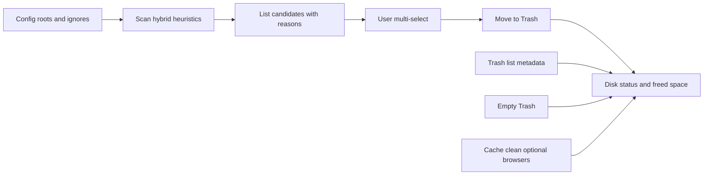

# PRD — Whirlpool CLI

## 1. Visão do produto

**Whirlpool** é o nome da CLI (referência à [galáxia Whirlpool](https://en.wikipedia.org/wiki/Whirlpool_Galaxy)). Ferramenta de linha de comando para **macOS (v1)** que ajuda o usuário a **recuperar espaço em disco** com baixo risco: identificar prováveis **arquivos órfãos** (restos de apps removidos), permitir **exclusão seletiva movendo para a Lixeira** (recuperável), **inspecionar e esvaziar a Lixeira**, e **limpar caches** com políticas claras. Em **todos** os comandos, a CLI deve exibir **quanto espaço foi liberado (ou será liberado)** e o **status atual do volume** (uso/capacidade/livre).

**Stack alinhada ao repositório:** Bun, pacote publicável sugerido `@whirlpool/cli` (ver [`apps/cli/package.json`](../apps/cli/package.json)), **binário/invocação `whirlpool`**, workspaces Turbo em [`package.json`](../package.json). O diretório do monorepo pode manter outro nome; o que o usuário digita no terminal é **`whirlpool`**.

---

## 2. Definições (glossário)

| Termo                         | Definição no produto                                                                                                                                                                       |
| ----------------------------- | ------------------------------------------------------------------------------------------------------------------------------------------------------------------------------------------ |
| **Arquivo órfão (candidato)** | Item do filesystem que **provavelmente** pertencia a um app **não mais presente** como `.app` instalado, segundo regras configuráveis + heurísticas (não é prova legal/técnica de “lixo”). |
| **Lixeira**                   | Lixeira do Finder do usuário (`~/.Trash` no macOS), para permitir **Restaurar** pelo sistema.                                                                                              |
| **Cache**                     | Conjuntos de diretórios/padrões sob controle do produto (usuário + opção browsers), **excluindo** paths na lista de ignorados do usuário.                                                  |

---

## 3. Escopo v1 e fora de escopo

**Incluído (v1):**

- Detecção **híbrida** de candidatos a órfãos:
  - **Heurística “B”**: além de pastas/arquivos em `~/Library` (ex.: `Application Support`, `Caches`, `Preferences`, `LaunchAgents`, `Containers`, `Group Containers`, `Saved Application State`, etc.) cujo identificador/nome **não mapeia** para nenhum app instalado em `/Applications` e `~/Applications`, incluir **sinais extras** com avisos: **symlinks quebrados** apontando para alvos inexistentes; onde aplicável, menções a `/Library/LaunchDaemons` (e similares) **somente com aviso de permissão** — operações que exijam `sudo` ficam **desabilitadas por padrão** ou como subcomando explícito “avançado” com documentação de risco.
  - **Caminhos configuráveis (“C”)**: o usuário pode **adicionar roots** em arquivo de config (ex.: `.whirlpool.toml` ou `~/.config/whirlpool/config.toml`); **default** de scanning: **`~/Library`**, **`~/Applications`** (e subárvores relevantes para resíduos; `Application Support` já coberto sob `~/Library/...`).
- **UI de seleção** para marcar o que vai para a Lixeira; confirmação final com resumo (contagem, tamanho total).
- **Comandos de Lixeira**: listar itens; esvaziar (com confirmação forte); ao listar, mostrar **metadados possíveis no macOS**.
- **Limpeza de cache**: opção **B** — cache do usuário + **flag/opção explícita** para incluir caches de **navegadores** (Safari/Chrome/Firefox/Edge), com **texto de risco** (sessão, thumbnails, recursos offline). **Lista de ignorados configurável** (globs ou paths) para o que o CLI **nunca** toca.
- **Painel de espaço/disco** em todo comando: antes/depois (quando aplicável), formato legível (GB/MB), e uso do volume principal (ex.: saída derivada de `statvfs`/`df` — implementação a escolher).

**Fora de escopo (v1) ou explícito como futuro:**

- Windows/Linux (roadmap).
- Garantia de “100% correto” para órfãos: o PRD deve comunicar **falsos positivos** (ex.: app portátil, app com nome diferente do bundle, dados compartilhados).
- **“Qual app criou o arquivo”** em sentido absoluto: nem sempre existe no filesystem; ver seção 6.

---

## 4. Personas e histórias de usuário

- **Usuário final em Mac**: quer liberar espaço sem medo de apagar algo crítico irreversível.
- **Usuário avançado**: quer customizar paths, ignorar diretórios, e eventualmente usar modos com mais privilégios.

Histórias resumidas:

1. Escanear defaults + paths extras → ver lista com tamanho e motivo da classificação → selecionar → mover para Lixeira → ver mensagem clara de recuperação via Lixeira.
2. Listar Lixeira com metadados → decidir esvaziar.
3. Limpar caches (com ou sem browsers) respeitando ignore list → ver espaço recuperado.
4. Em qualquer comando, ver **status do disco** e **delta de espaço**.

---

## 5. Comandos e comportamento (requisitos funcionais)

### 5.1 `whirlpool scan` (ou subcomando `orphans scan`)

- Varre roots: **default** `~/Library`, `~/Applications`, mais entradas do **config**.
- Produz **candidatos** com: path, tamanho (bytes), tipo (arquivo/pasta/symlink), **razão** (ex.: `no_matching_app`, `broken_symlink`, `launch_agent_residual` — taxonomia fixa no código).
- Opções: `--dry-run`, `--json` (para automação), verbosidade.
- **Não deleta**; só lista.

### 5.2 `whirlpool orphans clean` (ou fluxo interativo pós-scan)

- Reaproveita lista (ou re-scan coerente).
- **Seleção interativa** (multi-select): números, checkbox TUI (ex.: `blessed`/`ink`/`prompts` — decisão de implementação posterior), ou flags `--include` com globs para scripts.
- Ação: **mover para Lixeira** (API nativa preferível para integração Finder; fallback documentado).
- Mensagem padrão pós-ação: *“Itens movidos para a Lixeira; você pode restaurar pelo Finder.”*
- Mostrar **tamanho total movido** e **estimativa de espaço liberado** (nota: até esvaziar Lixeira, o “livre” no volume pode não refletir ganho definitivo — documentar).

### 5.3 `whirlpool trash list`

- Lista `~/.Trash` (e comportamento documentado para volumes externos se relevante).
- Colunas mínimas: nome, caminho na lixeira, tamanho, datas, dono/grupo, permissões.
- **Metadados estendidos** quando disponíveis (ver seção 6): Spotlight (`mdls` / MDQuery), xattrs comuns (`com.apple.quarantine`), inferência **heurística** de “app provável” pelo **path original** se armazenado (macOS às vezes preserva em metadados; se não, exibir “desconhecido”).

### 5.4 `whirlpool trash empty`

- Confirmação em duas etapas ou flag `--yes` para CI/expert.
- Exibir espaço que será liberado (soma dos itens na Lixeira).
- Após esvaziar, mostrar **delta** e status do disco.

### 5.5 `whirlpool cache clean`

- Default: caches “seguros” do usuário sob política definida no PRD técnico (lista inicial de diretórios-guia: `~/Library/Caches`, e correlatos documentados).
- Flag `--browsers` (ou config): inclui caches de browsers com **aviso obrigatório** na primeira execução ou quando a flag é usada.
- Respeitar **ignore list** do config (globs).
- Suportar `--dry-run`, resumo de tamanho, confirmação.

### 5.6 `whirlpool disk` (opcional mas recomendado)

- Comando dedicado só para status do(s) volume(s), reutilizado internamente pelos outros para cabeçalho/rodapé consistente.

---

## 6. Metadados — honestidade de produto

**Obrigatório no PRD/UX:** explicar limites.

- **Criação/modificação/dono**: via `stat` (Bun `stat` ou syscall) — **confiável**.
- **“Quem criou / qual app criou”**: em muitos arquivos **não há campo confiável**; Spotlight pode expor `kMDItemWhereFroms` (downloads) ou tipo (`kMDItemKind`). **Requisito de produto:** mostrar **“App inferido”** apenas quando houver evidência (path, bundle id em nome de pasta, ou metadado); caso contrário **`unknown`**.
- **Integridade**: leitura de metadados não deve alterar atributos.

---

## 7. Configuração e UX de segurança

- Arquivo de config versionado (schema simples):
  - `scan.roots[]` adicionais
  - `cache.ignore[]` (globs/paths)
  - opcional: `cache.browsers.enabled` default false
- **Dry-run** como padrão para primeira execução de comandos destrutivos (decisão de produto: recomendado).
- Logs claros em inglês para mensagens técnicas (**comentários/código em inglês**, conforme regra do projeto); **UI/saída** pode ser i18n futuro — v1 PT ou EN conforme decisão única.

---

## 8. Requisitos não funcionais

- **Performance**: scan incremental/async; não travar em árvores gigantes (limite de profundidade configurável ou aviso).
- **Confiabilidade**: erros por arquivo não derrubam o scan completo; relatório de falhas.
- **Privacidade**: tudo local; sem telemetria por padrão.
- **Compatibilidade**: macOS alvo (ex.: últimas 2–3 major versions) a fixar no README técnico.

---

## 9. Métricas de sucesso

- Usuário consegue **prever** o impacto (tamanhos corretos ± tolerância).
- **Zero exclusão permanente** no fluxo principal de “limpar órfãos”.
- Redução de suporte: mensagens explícitas sobre Lixeira e falsos positivos.

---

## 10. Riscos

| Risco                                                        | Mitigação                                  |
| ------------------------------------------------------------ | ------------------------------------------ |
| Falso positivo apaga dados “ainda úteis” (movidos à Lixeira) | Lixeira + motivo exibido + dry-run         |
| Cache de browser quebra sessão                               | Opt-in + aviso                             |
| Paths de sistema precisam sudo                               | Não automático; subcomando/documentação    |
| Metadados “app criador” inexistentes                         | Rótulo `unknown` + inferência conservadora |

---

## 11. Diagrama de fluxo (visão)

---

## 12. Próximo passo após aprovação do PRD

- Congelar **taxonomia de razões** de órfão e **lista inicial** de diretórios `~/Library/*`.
- Especificar formato exato do config e do `--json` de saída.
- Spike técnico: **mover para Lixeira** com API que o Finder reconhece (versus `mv` bruto).
